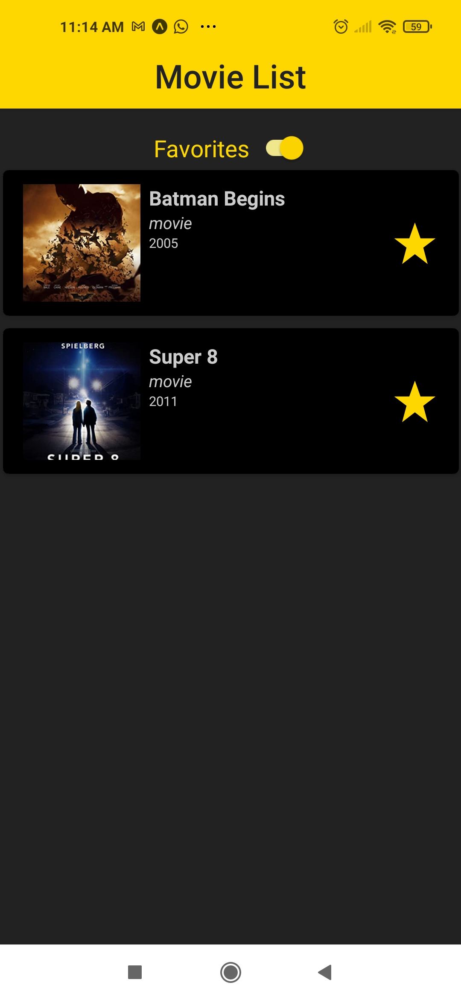

# Movie List
Este aplicativo permite que o usuário pesquise por filmes e séries na base The Open Movie Database (http://www.omdbapi.com/). Além disso, o usuário pode criar uma lista de filmes e séries favoritos.

## Tela inicial do aplicativo

  

Nela é possível pesquisar por filmes e séries na base The Open Movie Database.

  

A qualquer momento é possível marcar um filme ou série como favorito, clicando na estrela vázia correspondente ao filme desejado.

  

Para visualizar a lista de filmes adicionados à lista de favoritos, basta ativar a visualização da lista de favotitos no topo da tela.

  

Um filme ou série pode ser removido da lista de favoritos a qualquer momento, clicando na estrela cheia correspondente ao filme desejado.

  

